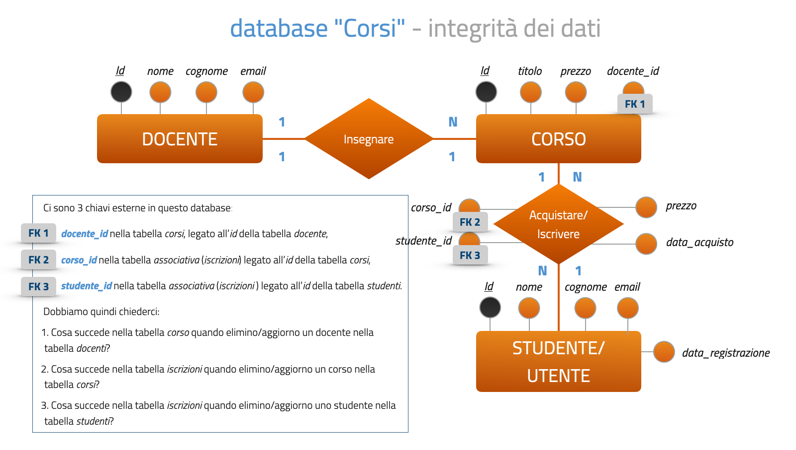
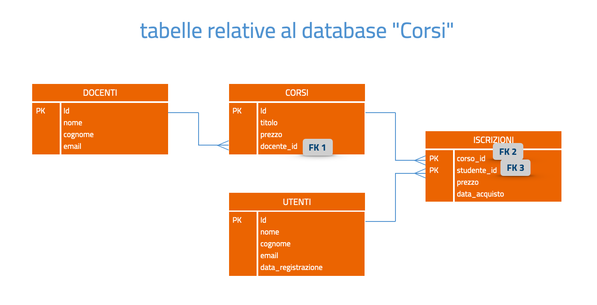

## Integrità referenziale

`FOREIGN KEY`: gestire le relazioni tra tabelle

**L'integrità referenziale è un insieme di regole che garantiscono la validità delle relazioni tra i record di tabelle correlate.**

Serve a prevenire la modifica o l’eliminazione accidentale di dati collegati.

Le chiavi esterne (Foreign Key) possono essere utilizzate solo se:

- Entrambe le tabelle utilizzano il motore InnoDB.

- Il campo della tabella primaria è una chiave primaria o `UNIQUE` (MySQL richiede che il campo referenziato sia indicizzato e unico).

- I campi correlati hanno lo stesso tipo di dati (tipi compatibili sono sufficienti), signedness, lunghezza e collation se la chiave è stringa.

- I campi coinvolti nella relazione hanno un indice (ad es. `PRIMARY KEY`, `UNIQUE`, o `INDEX`)

- Non si utilizzano campi di tipo `BLOB` o `TEXT` nelle chiavi coinvolte.

Le Foreign Key permettono di definire il comportamento del database quando si tenta di eliminare, inserire o modificare un record nella tabella primaria che è collegato a uno o più record nella tabella secondaria.

---



---



---

Possiamo definire alcune azioni diverse da attivare in caso di cancellazione o modifica:

**CASCADE**

In questo caso la cancellazione o modifica di un record nella tabella primaria genererà la cancellazione o la modifica dei record collegati nella tabella secondaria.

**SET NULL**

In caso di eliminazione o modifica di un record nella tabella primaria i record collegati della tabella secondaria verranno modificati impostando il valore del campo chiave esterna = NULL.

Questa azione è attivabile solo se il campo interessato della tabella secondaria non è impostato a NOT NULL (non deve essere required).

**RESTRICT, NO ACTION**

`RESTRICT` o `NO ACTION` (In MySQL si comportano allo stesso modo)

Queste due azioni (alternative) impediscono direttamente la modifica o la cancellazione dei record della tabella primaria.

Praticamente specificare una di queste due azioni equivale a non eseguire alcuna azione.Valore di default in assenza di indicazioni diverse quando si costruisce il vincolo di chiave esterna.

> Nota: in SQL STANDARD, `RESTRICT` e `NO ACTION` non sono equivalenti:
 - `RESTRICT` (immediate constraint check).
 - `NO ACTION` (deferred constraint check)

---

Sintesi:

**Comportamento in DELETE/UPDATE**

 - **CASCADE** → elimina/aggiorna tutti i figli

 - **SET NULL** → imposta le FK a NULL

 - **RESTRICT/NO ACTION** → blocca l’operazione

---

### RESTRICT

**Esempio**.

Creiamo un vincolo tra le due tabelle (*docenti*, *corsi*) per mezzo dei campi `docente.id` e `corsi.docente_id`

```sql
CREATE TABLE docenti (
    id INT auto_increment,
    nome VARCHAR(30),
    cognome VARCHAR(50),
    email VARCHAR(100),
    PRIMARY KEY(id)
);
```

```sql
CREATE TABLE corsi (
    id INT auto_increment,
    titolo VARCHAR(100),
    prezzo DECIMAL(6,2),
    docente_id INT,
    PRIMARY KEY (id),
    INDEX docente_key(docente_id), -- se non inserito viene aggiunto dal motore mysql
    CONSTRAINT fk_corsi_docenti -- diamo un nome alla FOREIGN kEY (opzionale, se non lo specifichiamo viene assegnato dal motore)
    FOREIGN KEY(docente_id) REFERENCES docenti(id)
     ON DELETE RESTRICT
     ON UPDATE RESTRICT
 ); -- possiamo anche omettere le azioni in questo caso perché RESTRICT o NO ACTION sono default
```

In questo modo

- abbiamo creato una chiave esterna nella tabella secondaria corsi riferita al campo id della tabella primaria docenti chiamata *fk_corsi_docenti*;

- abbiamo impostato le azioni da seguire in caso di eliminazione o aggiornamento di un record nella tabella *docenti*.

Nell’esempio abbiamo stabilito che non possiamo eliminare un docente se il suo id è presente nella tabella *corsi*.

```sql
DELETE FROM docenti
WHERE id = 1;
```

Questa query restituisce l’errore:

```bash
Cannot delete or update a parent row: a foreign key…
```

Nel caso specifico abbiamo stabilito che non si può eliminare un docente dalla tabella *docenti* se il suo *id* è presente nella tabella *corsi*, prima bisogna eliminare le dipendenze nella tabella *corsi*.

```sql
DELETE FROM corsi
WHERE docente_id = ;
```

Ora posiamo eseguire la query precedente:

```sql
DELETE FROM docenti
WHERE id = 1;
```

### CASCADE

Se vogliamo modificare la `FOREIGN KEY` dobbiamo prima eliminarla:

```sql
ALTER TABLE corsi
DROP FOREIGN KEY fk_corsi_docenti;
```

e poi ricrearla da capo con le nuove regole:

```sql
ALTER TABLE corsi
ADD CONSTRAINT fk_corsi_docenti
FOREIGN KEY(docente_id) REFERENCES docenti(id)
ON DELETE CASCADE ON UPDATE CASCADE;
```

In questo modo abbiamo ricreato la chiave esterna con le nuove azioni da seguire in caso di eliminazione o aggiornamento di un record nella tabella *docenti*.

Ora la query seguente elimina a cascata tutti i record associati nella tabella figlia (*corsi*)

```sql
DELETE FROM docenti
WHERE id = 1;
```

```sql
ALTER TABLE corsi
DROP FOREIGN KEY fk_corsi_docenti;
```

### SET NULL

nuove regole:

```sql
ALTER TABLE corsi
ADD CONSTRAINT fk_corsi_docenti
FOREIGN KEY(docente_id) REFERENCES docenti(id)
ON DELETE SET NULL ON UPDATE CASCADE;
```

Nel caso specifico abbiamo stabilito che eliminando un docente dalla tabella *docenti*, impostiamo a `NULL` le dipendenze (*campo docente_id*) nella tabella *corsi*.

```sql
DELETE FROM docenti
WHERE id = 1;
```

- Questa query viene eseguita;

- Contemporaneamente vengono aggiornate le righe con il campo `docente_id = 1` della tabella corsi, impostando il valore del campo *docente_id* a `NULL`

---

### SELF-FOREIGN KEY

Possiamo definire anche una chiave esterna riferita alla stessa tabella.

Possiamo definire cioè una **SELF-FOREIGN KEY**.

Consideriamo come esempio una ipotetica tabella *impiegati* dove per ciascun impiegato registro anche l'attributo identificativo del suo impiegato responsabile:

```sql
CREATE TABLE IF NOT EXISTS impiegati (
  id int auto_increment,
  nome varchar(50),
  cognome varchar(50),
  ruolo varchar(50),
  responsabile_id int,
  stipendio decimal(6,2),
  FOREIGN KEY (responsabile_id) REFERENCES impiegati(id)
 ON DELETE SET NULL,
  PRIMARY KEY(id)
);
```

In questo caso il campo *responsabile_id* è chiave esterna riferita all' *id* di ciascun impiegato.

---

### Controllo delle FOREIGN KEY in fase di INSERT

Quando una tabella contiene una chiave esterna (FOREIGN KEY), MySQL verifica che i valori inseriti rispettino i vincoli di integrità referenziale, anche durante un'operazione di `INSERT`.

**Non è possibile inserire un record nella tabella corsi specificando un valore per docente_id che non esiste nella tabella docenti**.

Supponiamo che la tabella *docenti* contenga i seguenti ID: 1, 3, 4, 6, 7, 8, 10:

```sql
INSERT INTO Corsi(titolo, prezzo, docente_id)
VALUES('JQuery', 100.00, 12);
```

MySQL blocca l’operazione perché il valore 12 per *docente_id* non esiste nella tabella *docenti*, violando così il vincolo di chiave esterna.

---

#### Visualizzare la definizione della chiave esterna di una tabella:

```sql
SHOW CREATE TABLE nome_tabella;
```

#### Visualizzare tutte le chiavi esterne presenti in un database:

```sql
SELECT TABLE_NAME, COLUMN_NAME, CONSTRAINT_NAME, REFERENCED_TABLE_NAME, REFERENCED_COLUMN_NAME
FROM INFORMATION_SCHEMA.KEY_COLUMN_USAGE
WHERE TABLE_SCHEMA = 'nome_db'/*
AND TABLE_NAME = 'nome_tabella' */
AND referenced_column_name is not NULL;
```

#### Visualizzare tutte le informazioni sui vincoli di chiave esterna di un database:

```sql
SELECT * FROM INFORMATION_SCHEMA.REFERENTIAL_CONSTRAINTS
WHERE CONSTRAINT_SCHEMA = 'nome_db';
```

Questa vista può sostituire la query precedente basata su `INFORMATION_SCHEMA.KEY_COLUMN_USAGE` quando l’obiettivo è conoscere esattamente:

- quali Foreign Key esistono

- come sono configurate

- quali azioni eseguono in caso di UPDATE/DELETE

La query su `KEY_COLUMN_USAGE` è utile per vedere quali colonne partecipano alla relazione, ma non contiene le informazioni su `CASCADE`, `SET NULL`, `RESTRICT` ecc.

---

#### Uso delle variabili di sistema per disabilitare temporaneamente i controlli

FOREIGN_KEY_CHECKS è una variabile di sistema che ci consente di disabilitare temporaneamente i controlli sulle `FOREIGN KEY`:

```sql
SET FOREIGN_KEY_CHECKS = 0;
```

Ricordatevi di ripristinarle dopo un eventuale inserimento massiccio di record

```sql
SET FOREIGN_KEY_CHECKS = 1;
```

> NOTA: disabilitare le chiavi esterne può essere utile durante il popolamento massivo del database, quando i dati vengono caricati senza rispettare l’ordine logico delle dipendenze tra tabelle: es: con chiave esterna attiva non posso caricare record dei corsi prima di caricare i record dei docenti.

> ATTENZIONE: NON è raccomandato in produzione!

**ATTENZIONE**:

- `SET FOREIGN_KEY_CHECKS = 0` → MySQL ignora temporaneamente i vincoli di integrità referenziale.

- Puoi inserire, aggiornare o cancellare dati senza che il DB controlli le Foreign Key.

- I dati già presenti e quelli inseriti mentre i controlli sono disabilitati non vengono modificati o ripuliti automaticamente.

**Quando riattivi i controlli (SET FOREIGN_KEY_CHECKS = 1), il DB non corregge i dati già violanti i vincoli**.

Solo le nuove operazioni saranno soggette ai controlli: i dati che violano le FK permangono nel database fino a correzione manuale.