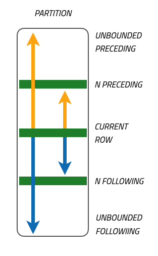

## Window function

Le window function ([^1]) (disponibili a partire da MySQL 8) eseguono operazioni aggregate su un insieme di righe specificato, ma a differenza delle funzioni aggregate utilizzate con la clausola `GROUP BY`, producono un risultato per ogni riga della query.

- Ogni riga su cui viene valutata la funzione è definita riga corrente;

- Le righe della query coinvolte nella valutazione della funzione costituiscono la finestra associata alla riga corrente.

Le funzioni aggregate con `GROUP BY` riducono il numero totale di righe restituite dalla query, le window function operano su un sottoinsieme di righe senza ridurre il numero di righe restituite dalla query stessa.

Forniscono un'analisi dettagliata dei dati in base alle condizioni specificate nella finestra di valutazione.

[^1] approfondimento: https://dev.mysql.com/doc/refman/8.0/en/window-functions.html

La maggior parte delle funzioni aggregate possono essere utilizzate anche come funzioni finestra:

`SUM()`, `AVG()`, `COUNT()`, `MAX()`, `MIN()`.

### Tabella WINDOWS FUNCTION

| Function	| Descrizione |
| ---- | ---- |
| CUME_DIST() |	Valore della distribuzione cumulativa |
| DENSE_RANK() |	Rango della riga corrente all'interno della sua partizione, senza spazi vuoti. |
| FIRST_VALUE() |	Valore dell'argomento dalla prima riga del frame della finestra. |
| LAG() |	Valore dell'argomento dalla riga in ritardo rispetto alla riga corrente all'interno della partizione. |
| LAST_VALUE() |	Valore dell'argomento dall'ultima riga del frame della finestra. |
| LEAD() |	Valore dell'argomento dalla riga in anticipo rispetto alla riga corrente all'interno della partizione. |
| NTH_VALUE() |	Valore dell'argomento dalla N-esima riga del frame della finestra. |
| NTILE() |	Numero del bucket della riga corrente all'interno della sua partizione. |
| PERCENT_RANK() |	Valore del rango percentuale. |
| RANK() |	Rango della riga corrente all'interno della sua partizione, con spazi vuoti. |
| ROW_NUMBER() |	Numero della riga corrente all'interno della sua partizione. |

---

### Sintassi:

```sql
window_function_name(expression) OVER ( 
   [partition_definition]
   [order_definition]
   [frame_definition]
)
```

**window_function_name**: specifica il nome della funzione finestra seguito da un'espressione.

L'istruzione `OVER()` ha tre possibili elementi:

- definizione della partizione: `PARTITION BY <expression>`
  Suddivide le righe in blocchi o partizioni . Due partizioni sono separate da un confine di partizione.
  La funzione finestra viene eseguita all'interno delle partizioni e reinizializzata quando si attraversa il confine della partizione.

- definizione dell’ordine: `ORDER BY <expression>`
  specifica come vengono ordinate le righe all'interno di una partizione. È possibile ordinare i dati all'interno di una partizione su più chiavi, ciascuna  chiave è specificata da un'espressione. Ha senso utilizzare `la ORDER BY` solo per le funzioni della finestra sensibili all’ordine.

- definizione del frame.
  Un frame è un sottoinsieme della partizione corrente.

**Le parentesi di apertura e chiusura**, che compaiono dopo la clausola `OVER()`, **sono obbligatorie**, anche senza espressione.

#### [frame_definition]: frame_unit {<frame_start>|<frame_between>}

<table>
  <tr>
    <td width="75%">
      <ul>
        <li>
          <strong>ROWS</strong>: specifica un numero fisso di righe da includere nel frame,
          a partire dalla riga corrente.<br>
          Esempio:<code>ROWS 3 PRECEDING</code> include le tre righe precedenti alla riga corrente.<br>
          Esempio: <code>ROWS BETWEEN 1 PRECEDING AND 1 FOLLOWING</code> include la riga corrente
          e le due righe adiacenti.
        </li>
      </ul>
      <ul>
        <li>
          <strong>RANGE</strong>: specifica un intervallo di valori da includere nel frame,
          invece di un numero fisso di righe.<br>
          È utile quando i dati sono ordinati per valori continui
          (date, numeri, timestamp).<br>
          Esempio:
          <code>RANGE BETWEEN INTERVAL 1 DAY PRECEDING AND CURRENT ROW</code>
          include tutte le righe con data entro un giorno dalla riga corrente.
        </li>
      </ul>
      <p>Per quanto riguarda frame_start e frame_between, sono parte della sintassi per specificare il frame unit.</p>
      <ul>
        <li>
          <strong>frame_start</strong>: specifica l’inizio del frame.
        </li>
        <li>
          <strong>frame_between</strong>: specifica l’intervallo del frame.
        </li>
        </ul>
        <p>Questi possono essere utilizzati per definire il frame unit in modo più dettagliato rispetto a quanto fatto utilizzando solo ROWS o RANGE.</p>
        <ul>
        <li>
          Esempio:
          <code>ROWS BETWEEN 3 PRECEDING AND CURRENT ROW</code> definisce un frame unit che include le tre righe precedenti alla riga corrente e la riga corrente stessa.
        </li>
        <li>
          Esempio:
          <code>RANGE BETWEEN INTERVAL 1 DAY PRECEDING AND CURRENT ROW</code> definisce un frame unit che include tutte le righe con date entro un giorno prima o uguale alla data della riga corrente.
        </li>
      </ul>
    </td>
    <td width="25%">
      
    </td>
  </tr>
</table>

il **frame unit** specifica quali righe devono essere incluse nel calcolo della funzione per ogni riga corrente. Le opzioni principali per il frame unit sono:

Valore di default: `RANGE BETWEEN UNBOUNDED PRECEDING AND CURRENT ROW`

---

### `AVG()`

*Esempio*: 

Voglio ottenere la differenza di stipendio per ciascun impiegato rispetto allo stipendio medio:

```sql
SELECT
    nome,
    cognome,
    stipendio,
    ROUND(AVG(stipendio) OVER(),2) `Stipendio medio`,
    stipendio - ROUND(AVG(stipendio) OVER(),2) Differenza
FROM impiegati
ORDER BY stipendio DESC;
```

*Esempio*:

Voglio ottenere la differenza di stipendio per ciascun impiegato rispetto allo stipendio medio del dipartimento(ufficio) di appartenenza:

```sql
SELECT
    nome,
    cognome,
    ufficio_id,
    stipendio,
    ROUND(
AVG(stipendio) OVER(PARTITION BY ufficio_id)
,2) `Salario medio`,
    stipendio - ROUND(
AVG(stipendio) OVER(PARTITION BY ufficio_id)
,2) `Differenza`
FROM impiegati
ORDER BY stipendio DESC;
```

### `SUM()`

*Esempio*:

Supponiamo di avere una tabella vendite che registra le vendite degli impiegati per anno fiscale.

Nella tabella vendite abbiamo un riferimento all’id dell’impiegato, l’anno fiscale e la somma delle vendite per quell’anno.

Voglio ottenere le vendite totali SUM(vendita) per anno fiscale OVER (PARTITION BY anno)

```sql
SELECT 
    anno, 
    cognome,
    nome,
    totale,
    SUM(totale) OVER (
        PARTITION BY anno -- crea le partizioni considerando gli anni
        -- default, prende tute le righe della partizione
        -- RANGE BETWEEN UNBOUNDED PRECEDING AND CURRENT ROW
        -- prendo riga precedente e successiva
        -- ROWS BETWEEN 1 PRECEDING AND 1 FOLLOWING -- prendo riga precedente e successiva
        -- prendo le 2 righe precedenti
        -- ROWS 2 PRECEDING  
    ) vendite_totali
FROM vendite
JOIN impiegati
ON impiegati.id = vendite.impiegato_id;
```

*Esempio*:

Voglio ottenere le vendite totali SUM(totale) per anno fiscale OVER (PARTITION BY anno) e il valore percentuale:

```sql
SELECT 
    anno, 
    cognome,
    nome,
    totale,
    SUM(totale) OVER (
        PARTITION BY anno 
    ) `vendite totali`,
    ROUND(totale / SUM(totale) OVER (
        PARTITION BY anno
    ) * 100, 2) `Percentuale`
FROM vendite
JOIN impiegati
ON impiegati.id = vendite.impiegato_id;
```

### LAG()

La funzione `LAG()` restituisce il valore di una colonna dalla riga precedente rispetto alla riga corrente all'interno di una finestra.

```sql
LAG(expression [, offset] [, default]) OVER (
    [PARTITION BY partition_expression, ...]
    ORDER BY order_by_expression
)
```

*Esempio*:

La seguente query utilizza la funzione `LAG()` per confrontare le vendite di un anno con quello precedente:

```sql
SELECT 
  cognome,
  nome,
anno,
  totale,
  LAG(totale, 1 , 0) OVER (
    --  la funzione LAG() restituisce le vendite dell'anno precedente
    --  (o zero) dalla riga corrente, senza 0 il valore è NULL
    PARTITION BY impiegato_id
    -- divide le righe nella tabella delle vendite
    -- in partizioni in base agli addetti alle vendite
    ORDER BY anno 
    -- le righe in ciascuna partizione vengono ordinate
    -- in base alla colonna dell'anno fiscale
  ) 'anno precedente' 
FROM vendite
JOIN impiegati
ON impiegati.id = vendite.impiegato_id;
```

*Esempio*:

La seguente query utilizza due volte la funzione `LAG()`.

Per confrontare le vendite di un anno con quello precedente, e con i due anni precedenti:

```sql
SELECT 
  cognome,
  nome,
  anno,
  totale,
  LAG(totale, 1, 0) OVER (
    PARTITION BY impiegato_id
    ORDER BY anno 
  ) 'anno precedente',
  LAG(totale, 2, 'nessun riferimento') OVER (
    PARTITION BY impiegato_id
    ORDER BY anno 
  ) '2 anni precedenti' 
FROM vendite
JOIN impiegati
ON impiegati.id = vendite.impiegato_id;
```

### LEAD()

La funzione `LEAD()` restituisce il valore di una colonna dalla riga successiva rispetto alla riga corrente all'interno di una finestra.

```sql
LEAD(expression [, offset] [, default]) OVER (
    [PARTITION BY partition_expression, ...]
    ORDER BY order_by_expression
)
```

*Esempio*:

L'esempio seguente utilizza la funzione `LEAD()` per inserire le vendite della riga successiva nella riga corrente:

```sql
SELECT 
  cognome,
  nome,
anno,
  totale,
  LEAD(totale, 1 , 0) OVER (
    PARTITION BY impiegato_id
    ORDER BY anno
  ) AS 'anno successivo' 
FROM vendite
JOIN impiegati
ON impiegati.id = vendite.impiegato_id;
```

### ROW_NUMBER()

La funzione `ROW_NUMBER()` restituisce il numero di riga corrente all'interno di una finestra.

È utile per ottenere informazioni sulla posizione relativa di una riga rispetto alle altre all'interno della finestra.

```sql
ROW_NUMBER() OVER (
    [PARTITION BY partition_expression, ...]
    ORDER BY order_by_expression
)
```

*Esempio*:

```sql
SELECT
    id,
    cognome, 
    data_nascita,
    UPPER(provincia) `Provincia`,
    ROW_NUMBER() OVER( PARTITION BY provincia ORDER BY data_nascita ) `Posizione nella partizione`,
    ROW_NUMBER() OVER() `Posizione sul totale`
FROM studenti
ORDER BY provincia, data_nascita;
```

**Nota**: la prima funzione mostra il numero di riga per ciascuna provincia, mentre la seconda mostra il numero progressivo assoluto nel set risultante.

### RANK()

La funzione `RANK()` assegna un valore di rango a ciascuna riga all'interno di una finestra, assegnando lo stesso valore a righe con valori uguali e saltando i valori successivi.

Se ci sono più righe con lo stesso valore ordinato, ottengono lo stesso valore di rango e il successivo viene saltato.

```sql
RANK() OVER (
    [PARTITION BY partition_expression, ...]
    ORDER BY order_by_expression
)
```

### DENSE_RANK()

La funzione `DENSE_RANK()` è simile a `RANK()`, ma non salta i valori successivi se ci sono valori duplicati.

Assegna un valore di rango senza salti anche in presenza di valori uguali.

```sql
DENSE_RANK() OVER (
    [PARTITION BY partition_expression, ...]
    ORDER BY order_by_expression
)
```

Esempio: ROW_NUMBER(), RANK() e DENSE_RANK() 

```sql
SELECT 
    cognome, 
    data_nascita,
    UPPER(provincia) `Provincia`,
    ROW_NUMBER() OVER(PARTITION BY provincia ORDER BY data_nascita, cognome ) `Riga`,
    RANK() OVER(PARTITION BY provincia ORDER BY data_nascita ) `Rank`,
    DENSE_RANK() over(PARTITION BY provincia ORDER BY data_nascita ) `Dense rank`
FROM studenti;
```

```sql
SELECT
    i.nome,
    cognome,
    stipendio,
    u.nome `Dipartimento`,
    ROW_NUMBER() OVER(PARTITION BY ufficio_id ORDER BY stipendio) `Riga`,
    RANK() OVER(PARTITION BY ufficio_id ORDER BY stipendio ) `Rank`,
    DENSE_RANK() OVER(PARTITION BY ufficio_id ORDER BY stipendio ) `Dense rank`
FROM impiegati i
JOIN uffici u
ON i.ufficio_id = u.id
ORDER BY ufficio_id;
```