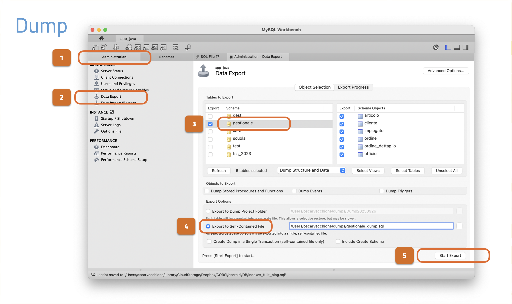
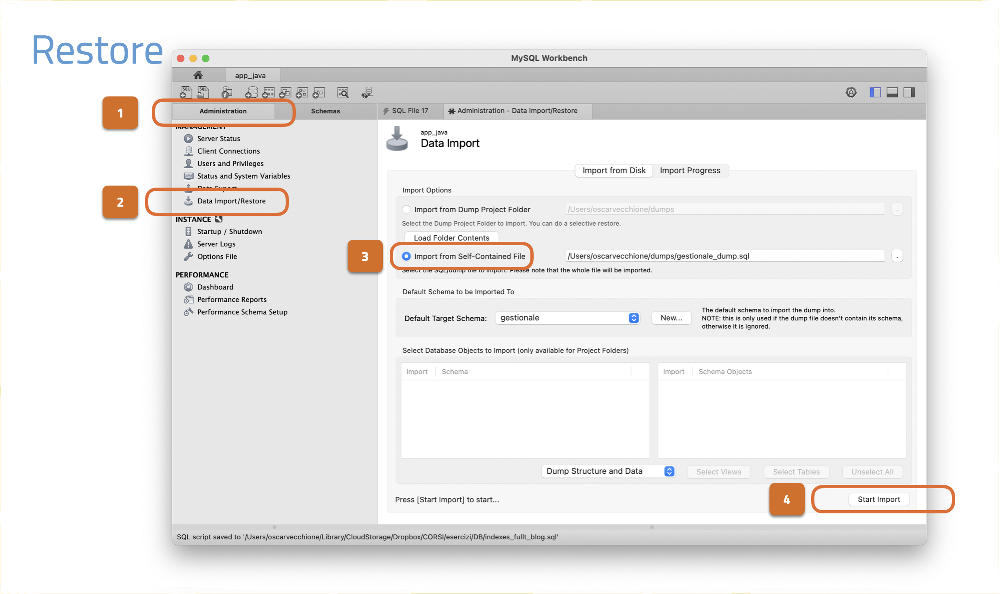
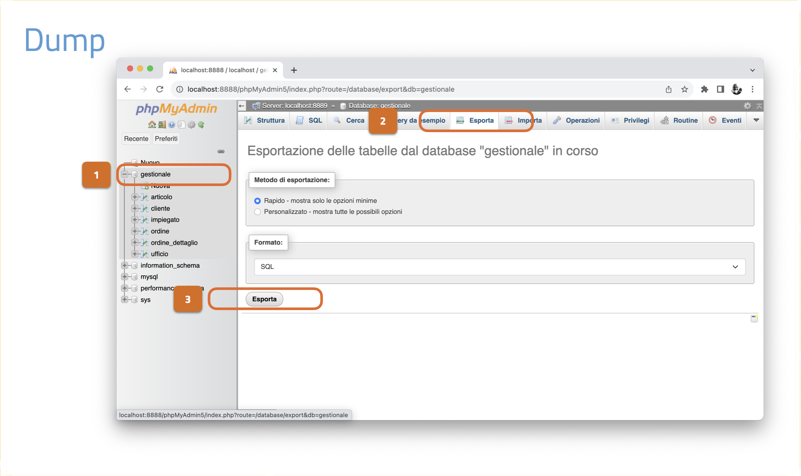
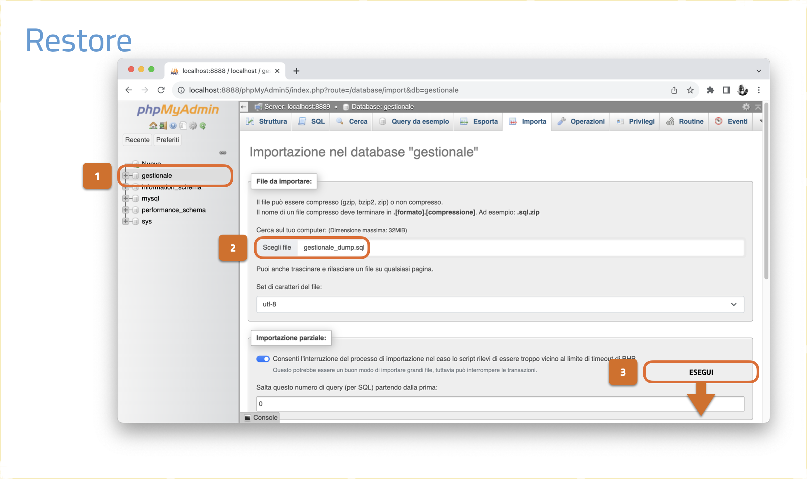

## Backup (dump) e restoring

Il termine **dump** nel contesto di un database si riferisce a una copia completa o a uno snapshot del database in un determinato momento.

Questo processo di creazione di una copia completa dei dati e delle strutture del database è noto come **dumping del database**.

Il termine **dump** *deriva dalla parola inglese dump*, che significa *scaricare o gettare in modo informale*.

In questo caso, il "dump" **è una rappresentazione completa delle strutture e dei dati**, spesso sotto forma di un file o di un insieme di file, che può essere archiviato o trasferito in altri sistemi per scopi di backup, ripristino o migrazione.

Il dump quindi, è un **backup logico, non fisico** (istruzioni SQL per ricreare oggetti e dati).

Un dump di database può contenere tutte le tabelle, gli indici, le viste e altri oggetti di database, insieme a tutti i dati in essi contenuti.

Questo snapshot rappresenta *una fotografia del database in un momento specifico* e può essere utilizzato per ripristinare il database in caso di perdita di dati o per clonare il database su un altro sistema.

In breve, il termine *dump* nel contesto dei database indica la creazione di una copia completa e statica dei dati del database, ed è una pratica comune nell'amministrazione dei database per scopi di backup e manutenzione.

---

### DUMP di un DB MySQL (da interfaccia grafica)

Normalmente l'operazione di backup (dump) di un DB MySQL si esegue attraverso un software con un’interfaccia grafica.

Ci sono vari software che vi consentono di gestire il database:

- sul web il più diffuso è sicuramente PhpMyAdmin, software scritto in php.

- in locale (sul proprio PC) il più diffuso è sicuramente MySQLWorkbench.

Le operazioni di esportazione e importazione si trovano in apposite sezioni di questi software:

- Sezione "Administration", item "Data Export" per l’esportazione; item "Data Import/Restore" per l’importazione (MySQLWorkbench)

- Sezione (tab) "Esporta" per l’esportazione; sezione (tab) "Importa" per il ripristino (PhpMyAdmin);

---

#### MySQLWorkbench




---

#### PhpMyAdmin





---

### Backup di un DB MySQL (da shell)

#### Privilegi da amministratore: utente root

L'operazione di backup (dump) di un DB MySQL, normalmente, si esegue attraverso il comando mysqldump prima di collegarsi al db.

Nella sua versione base la sintassi è la seguente:

```bash
mysqldump -u root 1 -p nome_database > nomefile.sql 2
```

In questo caso stiamo esportando un database (nome_database);

```bash
mysqldump -u root 1 -p --databases db_1 db_2 db_3 > nomefile.sql 2
```

In questo caso stiamo esportando tre database: db_1, db_2, db_3;

```bash
mysqldump -u root -p --all-databases > nomefile.sql 2
```

In questo caso stiamo esportando tutti i database, utenti e privilegi;

L'opzione `--databases` scrive l’istruzione: `CREATE DATABASE IF NOT EXIST` e `USE [nomedb]`.

Note:

1) nome dell’utente, in questo caso l'utente con privilegi massimi

2) percorso del file in cui scrivere le istruzioni sql (es: C:/Users/anskat_PC/Desktop/), se si specifica solo il nome del file, il file viene copiato nella directory corrente (nel caso di xampp c:\xampp)

---

#### Privilegi da utente: esempio: app_java

L'operazione di backup (dump) di un DB MySQL, normalmente, si esegue attraverso il comando mysqldump prima di collegarsi al db.

Nella sua versione base la sintassi è la seguente:

```bash
mysqldump -u user 1 -p 2 --no-tablespaces 3 mio_db > mio_db.sql 4
```

1) nome dell’utente

2) per sicurezza la password viene digitata successivamente e non passata in chiaro

3) https://anothercoffee.net/how-to-fix-the-mysqldump-access-denied-process-privilege-error/

l’opzione `--no-tablespaces` prima di `-u user` è obbligatoria a partire da mysql 5.7.31 e 8.0.21

https://dev.mysql.com/doc/refman/5.6/en/innodb-system-tablespace.html

L'opzione `--no-tablespaces` evita gli errori legati ai permessi sui metadati avanzati, perché i tablespace sono configurazioni di storage avanzate che, se non usate esplicitamente, non influenzano i dati esportati.

4) percorso del file in cui scrivere il dump sql (es: C:/Users/anskat_PC/Desktop/), se si specifica solo il nome del file, il file viene copiato nella directory corrente.

---

- **Esportazione solo di una tabella**: *nome_tabella*;

```bash
mysqldump -u user1 -p --no-tablespaces mio_db nome_tabella > nomefile.sql2
```

- **Esportazione di più tabelle**: *nome_tabella01* *nome_tabella02* *nome_tabella03*

```bash
mysqldump -u user1 -p --no-tablespaces mio_db nome_tabella01 nome_tabella02 nome_tabella03 > nomefile.sql2
```

**Esportazione della sola struttura del database** (definizione delle tabelle)

```bash
mysqldump -u user1 -p --no-tablespaces -d mio_db > nomefile.estensione2
```

**Esportazione dei soli dati del database** (contenuti)

```bash
mysqldump -u user 1 -p --no-tablespaces -t mio_db > nomefile.estensione 2
```

Una volta premuto invio possiamo verificare se il file è stato creato correttamente nella directory indicata.

1. nome dell’utente

2. percorso del file in cui scrivere le istruzioni sql (es: C:/Users/anskat_PC/Desktop/), se si specifica solo il nome del file, il file viene copiato nella directory corrente

---

### Restoring di un DB MySQL

Il restoring del database di solito si esegue per spostare un database in altro database che qualcun altro ha creato per voi (DBA).

Il DBA vi fornisce le credenziali di accesso: *nome_database*, *host*, *user* e *password*.

**Questa la sintassi per il restoring**

```bash
mysql -u user -p mio_db < mio_db.sql
```

Se da un backup contenente una pluralità di DB ne vogliamo ripristinare uno solo, possiamo farlo utilizzando l'opzione `--one-database` in questo modo:

```bash
mysql -u user -p --one-database nome_del_db < backup.sql
```

Il db deve essere presente; bisogna avere i privilegi.