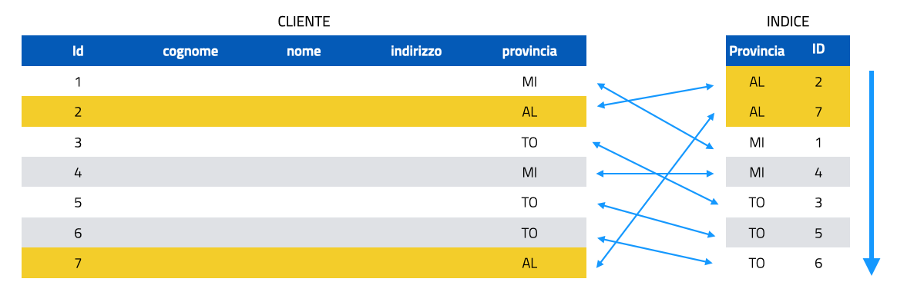
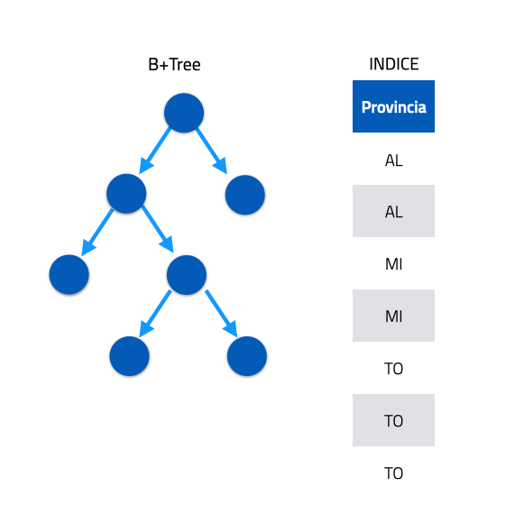

## INDICI

Quando il database cresce in dimensioni per rendere più veloce ed efficiente la ricerca si usano gli **INDICI** per i campi usati di frequente nel `WHERE`, `JOIN`, `GROUP BY` e `ORDER BY`.

L’aggiornamento, l’inserimento e la cancellazione dei record nella tabella sarà leggermente più lento perché anche l’indice dovrà essere aggiornato.

```sql
CREATE INDEX indexName
ON tableName(fieldName);
```

standard SQL

```sql
ALTER TABLE tableName
ADD INDEX indexName(fieldName);
```

Per eliminare l’indice creato:

```sql
DROP INDEX indexName ON tableName;
```

```sql
ALTER TABLE tableName DROP INDEX indexName;
```

Per rinominare l’indice:

```sql
ALTER TABLE tableName
```
```sql
RENAME INDEX oldName TO newName;
```

Per mostrare gli indici di una tabella

```sql
SHOW INDEX FROM tableName;
```

```sql
SHOW INDEX IN tableName;
```

In DESCRIBE nome_tabella (visualizzazione della struttura di una tabella), la colonna Key può assumere:

- PRI → chiave primaria

- UNI → indice UNIQUE

- MUL → indice non unico (valori ripetibili)

---

### Approfondimento sugli indici

Capire cosa sono gli indici è importante per riuscire a scrivere le query in modo performante.

Un indice è una sorta di schedario che tiene traccia su dove sono posizionati i dati all’interno delle tabelle nel database.

Gli indici possiamo considerarli *come delle tabelle speciali* associate alle tabelle dati consultabili dal database.

Ogni operazione che tenta il recupero di dati da qualsiasi tabella del database, in assenza di un indice, costringe il database a leggere l’intera tabella, eseguendo quello che in gergo viene definito **Table Scan** (lettura record per record di tutta tabella).

Attraverso l’INDICE il database identifica la posizione esatta dalle informazioni che usa per recuperare i dati necessari.

- si evita il Table Scan;

- il recupero dei dati su cui le query devono lavorare avviene in modo più veloce;

- la query stessa è più performante.

In InnoDB, un indice secondario memorizza i valori della colonna indicizzata (ordinati) insieme alla chiave primaria (PK) della riga corrispondente.

Durante una ricerca:

- se la query utilizza solo colonne presenti nell’indice (covering index), MySQL legge direttamente dall’indice senza accedere alla tabella;

- se la query richiede colonne non presenti nell’indice, MySQL usa la PK trovata per recuperare i dati aggiuntivi dal clustered index (tabella stessa).



Gli indici sono fondamentalmente strutture di dati, utilizzate dai motori di database per trovare rapidamente i dati.

MySQL utilizza come struttura dati per gli indici **B+Tree**.

Le strutture **B+Tree** sono mantenute in parte in memoria (nel buffer pool di InnoDB) per velocizzare l'accesso.

Se non presenti in memoria, vengono lette da disco.

Accedere prima agli indici è più performante e veloce nel recupero dei record piuttosto che leggere tutta la tabella (full table scan).

> Anche quando esiste un indice, *l’ottimizzatore può decidere di non usarlo* se stima che il full table scan sia più veloce (es. tabelle piccole o bassa selettività).

Se gli indici sono fondamentali per le performance delle query, bisogna considerare che:

 - Aumentano le dimensioni del database, vengono memorizzati con le tabelle;

 - Rallentano la scrittura, gli indici devono essere aggiornati;

È quindi fondamentale creare gli indici sulla base delle query e non in base alle tabelle.

> Approfondimento https://it.wikipedia.org/wiki/B-albero



Esempio di funzionamento del **B+Tree**

Cercare il valore 5:

1. Radice [25,50]: 5 < 25 → vai al primo ramo ([10,20]).
2. Nodo [10,20]: 5 < 10 → vai al primo ramo ([1,5]).
3. Nodo [1,5]: 5 è presente → valore trovato!

Perché è efficiente?

Il B+tree riduce i confronti necessari.

Con 8 valori nell'esempio, servono solo 3 passaggi (livelli).

In un indice reale con milioni di valori, i livelli sono tipicamente 4-5, rendendo le ricerche istantanee.

<pre>
                       [25, 50]
                   /      |       \
           [10, 20]   [30, 40]   [60, 70]
            /   |     /    |      /    \
      [1, 5] [15]  [27] [35]   [55] [65, 75]
</pre>

---

#### ANALYZE

Aggiorna le statistiche degli indici e della tabella per ottimizzare l’esecuzione delle query.

- Statistiche degli indici:

  - Distribuzione dei valori (cardinality: numero di valori unici presenti in quella colonna (o combinazione di colonne) indicizzata).

  - Densità dei dati (quanto è "affollato" un indice: quanto i valori in un indice sono ripetuti o distribuiti).

- Statistiche della tabella:

  - Numero di righe (rows).

  - Dimensione fisica della tabella.

Quando eseguirlo:

- Dopo modifiche massive ai dati;

- Quando le query diventano lente;

- Dopo modifiche strutturali importanti.

**Esempo**:

```sql
ANALYZE TABLE studenti;  -- Forza l’aggiornamento immediato
```

Restituisce:

```bash
+------------------+---------+----------+----------+
| Table            | Op      | Msg_type | Msg_text |
+------------------+---------+----------+----------+
| corsi.studenti   | analyze | status   | OK       |
+------------------+---------+----------+----------+
```

Quando Eseguire `ANALYZE TABLE`?

- dopo aver modificato >10% dei dati (es. inserimenti/cancellazioni massive);

- se le query diventano improvvisamente lente senza motivo apparente;

- dopo la creazione di nuovi indici.

---

#### EXPLAIN

L'istruzione `EXPLAIN` fornisce informazioni su come MySQL esegue le query:

`EXPLAIN` funziona con le istruzioni `SELECT`, `DELETE`, `INSERT` e `UPDATE`.

Quando viene utilizzato `EXPLAIN` con un'istruzione spiegabile, MySQL visualizza le informazioni dell'ottimizzatore sul piano di esecuzione dell'istruzione.

MySQL mostra come elaborerebbe l'istruzione, comprese le informazioni su come vengono unite le tabelle e in quale ordine.

Con l'aiuto di `EXPLAIN`, puoi vedere dove aggiungere indici alle tabelle in modo che l'istruzione venga eseguita più velocemente usando gli indici per trovare le righe.

```sql
SELECT nome, cognome, email, credito
FROM clienti
WHERE provincia = "To";
```

Se eseguiamo questa query in assenza di indici la tabella clienti verrà letta record per record fino a trovare le corrispondenze.

Il database inoltre accede al disco per la lettura della tabella (non sempre).

Verifichiamola con l’istruzione `EXPLAIN`

```sql
EXPLAIN
SELECT nome, cognome, email, credito
FROM clienti
WHERE provincia = "To";
```

Eseguita la query con `EXPLAIN`, mysql restituisce il piano di esecuzione risultante:

```bash
+----+-------------+---------+------------+------+---------------+------+---------+------+------+----------+-------------+
| id | select_type | table   | partitions | type | possible_keys | key  | key_len | ref  | rows | filtered | Extra       |
+----+-------------+---------+------------+------+---------------+------+---------+------+------+----------+-------------+
|  1 | SIMPLE      | cliente | NULL       | ALL  | NULL          | NULL | NULL    | NULL |    7 |    14.29 | Using where |
+----+-------------+---------+------------+------+---------------+------+---------+------+------+----------+-------------+
```

Osservate la colonna *type*, la colonna *key*, la colonna *rows* e la colonna *Extra*:

In assenza di indici vengono letti tutti i record.

Ora creiamo un indice sulla tabella *clienti* per l’attributo *provincia*

```sql
CREATE INDEX k_prov ON clienti(provincia);
```

Eseguite nuovamente la query con `EXPLAIN`:

```bash
+----+-------------+---------+------------+------+---------------+--------+---------+-------+------+----------+-----------------------+
| id | select_type | table   | partitions | type | possible_keys | key    | key_len | ref   | rows | filtered | Extra                 |
+----+-------------+---------+------------+------+---------------+--------+---------+-------+------+----------+-----------------------+
|  1 | SIMPLE      | cliente | NULL       | ref  | k_prov        | k_prov | 8       | const |    3 |   100.00 | Using index condition |
+----+-------------+---------+------------+------+---------------+--------+---------+-------+------+----------+-----------------------+
```

Come si può notare, type = ref indica che l'accesso è basato su una colonna indicizzata con valore costante, che è stato usato l’indice creato e le righe lette in totale sono 3.

Il filtro sui record ha la massima efficacia.

Consideriamo altro esempio:

```sql
SELECT nome, cognome, email, credito FROM clienti
WHERE provincia = "To" and credito > 100;
```

In questo caso la query utilizza l’indice.

```sql
EXPLAIN
SELECT nome, cognome, email, credito
FROM cliente
WHERE provincia = "To" and credito > 100;
```

```bash
+----+-------------+---------+------------+------+---------------+--------+---------+-------+------+----------+------------------------------------+
| id | select_type | table   | partitions | type | possible_keys | key    | key_len | ref   | rows | filtered | Extra                              |
+----+-------------+---------+------------+------+---------------+--------+---------+-------+------+----------+------------------------------------+
|  1 | SIMPLE      | cliente | NULL       | ref  | k_prov        | k_prov | 8       | const |    3 |    33.33 | Using index condition; Using where |
+----+-------------+---------+------------+------+---------------+--------+---------+-------+------+----------+------------------------------------+
```

Ma il valore di filtered è basso, si può quindi ottimizzare ulteriormente?

Creiamo un indice composto, cioè un indice su più campi

```sql
CREATE INDEX k_prov_credito ON clienti(provincia, credito);
```

Eseguiamo la query con `EXPLAIN`

```sql
EXPLAIN
SELECT nome, cognome, email, credito
FROM cliente
WHERE provincia = "To" AND credito > 100;
```

```bash
+----+-------------+---------+------------+-------+-----------------------+----------------+---------+------+------+----------+-----------------------+
| id | select_type | table   | partitions | type  | possible_keys         | key            | key_len | ref  | rows | filtered | Extra                 |
+----+-------------+---------+------------+-------+-----------------------+----------------+---------+------+------+----------+-----------------------+
|  1 | SIMPLE      | cliente | NULL       | range | k_prov,k_prov_credito | k_prov_credito | 13      | NULL |    1 |   100.00 | Using index condition |
+----+-------------+---------+------------+-------+-----------------------+----------------+---------+------+------+----------+-----------------------+
```

Quando si deve decidere l’ordine degli attributi nella creazione dell’indice **bisogna considerare le query che verranno utilizzate** e **la cardinalità (numero di valori distinti in una colonna) degli attributi scelti**:

```sql
SELECT nome, cognome, email, indirizzo, citta
FROM clienti
WHERE provincia = "To";
```

```sql
SELECT nome, cognome, email, indirizzo, citta, credito
FROM clienti
WHERE provincia = "To" and credito > 100;
```

L’indice composto più adatto è:

```sql
CREATE INDEX k_prov_credito ON clienti(provincia, credito);
```

Una linea guida suggerisce di mettere per prima la colonna con più alta cardinalità nell'indice composto, perché riduce meglio il numero di righe da analizzare.

Tuttavia, l'ordine corretto dipende sempre dalle query effettive eseguite.

È sempre consigliabile creare l'indice sulla base delle query reali, e verificare con `EXPLAIN ANALYZE` se la scelta è efficace.

---

#### EXPLAIN - sintesi

Cosa fa EXPLAIN:

- Mostra il piano di esecuzione della query.

- Aiuta a identificare colli di bottiglia.

Quando usarlo:

- Per ottimizzare query lente.

- Per verificare l’uso degli indici.

Output chiave da guardare:

- type: Tipo di accesso (es. ALL = scansione completa, index = lettura di tutto l'indice, range = legge più valori nell'indice, ref = uso indice)...

- key: Indice usato.

- rows: record letti.

- Extra: Operazioni aggiuntive (es. Using filesort = ordinamento lento).

> Un indice può evitare l’uso di filesort e temporary table se l’ordine richiesto coincide con l’ordine dell’indice.

Esiste anche una versione di EXPLAIN che mostra più dettagli: EXPLAIN FORMAT= JSON

---

#### EXPLAIN ANALYZE (MySQL 8+) – Analisi Reale delle Query

- `EXPLAIN` mostra il piano stimato.

- `EXPLAIN ANALYZE` mostra anche tempi e righe reali.

```sql
EXPLAIN ANALYZE 
SELECT nome, cognome, email
FROM impiegati_record -- tabella con oltre 300.000 righe 
WHERE provincia = 'TO';
```

```bash
-> Index lookup on impiegati_record using k_prov (provincia='TO'),
  with index condition: (impiegati_record.provincia = 'TO')
  (cost=6864 rows=54456) -- stima iniziale di righe lette
  (actual time=1.06..35.8 rows=27403 loops=1) -- righe effettivamente lette
```

Vantaggi:

- mostra tempo reale di esecuzione (actual time);

- mostra righe effettivamente lette (rows);

- aiuta a verificare se l’indice è realmente usato e utile.

> NOTA: Le stime possono essere sbagliate. EXPLAIN ANALYZE conferma cosa accade davvero.

**Riassumendo**

*Istruzioni per analizzare le query*

- EXPLAIN (testo o tabellare)
  - Mostra solo stime.
  - È il “piano previsto” dall’ottimizzatore.
- EXPLAIN FORMAT= JSON
  - Mostra ancora stime, ma molto più dettagliate, come:
  - costi stimati
  - condizioni pushdown
  - dettagli delle join
  - ottimizzazioni interne
  - uso degli hint
  - stima su righe filtrate, gruppi, file sort, temp table

- EXPLAIN ANALYZE
è il migliore strumento in assoluto per sapere come MySQL esegue davvero la query.
  - Esegue veramente la query
  - Riporta tempi reali per ogni step
  - Riporta righe realmente lette, non stimate
  - Confronta stime vs valori reali
  - Indica se l’indice è stato davvero usato
  - Mostra loop e iterazioni

---

**Quando NON è utile creare un indice**

Gli indici non sono sempre utili. In alcuni casi peggiorano le prestazioni.

Casi in cui evitarli:

- Colonne con pochi valori distinti
  
  Esempio: genere, attivo, is_admin (Alta probabilità di leggere molte righe comunque)

- Tabelle molto piccole
  
  Se la tabella ha poche centinaia di righe, il full table scan è più veloce

- Campi non usati in query
  
  Non indicizzare colonne mai usate in WHERE, JOIN, ORDER BY, GROUP BY

- Scritture frequenti
  
  Troppe scritture → overhead per aggiornare l’indice

> Regola pratica:

> **Crea indici in base alle query, non in base alla struttura della tabella**.

---

### Indice FULLTEXT

MySQL supporta l'indicizzazione e la ricerca full-text:

Gli indici **FULLTEXT** possono essere utilizzati solo con tabelle InnoDB e MyISAM.

MySQL supporta indici **FULLTEXT** in InnoDB da *MySQL 5.6*.

Possono essere creati solo per colonne `CHAR`, `VARCHAR` o `TEXT` (nelle diverse lunghezze).

L’indice **FULLTEXT** può essere definito quando viene creata una tabella o aggiunto in seguito utilizzando `ALTER TABLE` o `CREATE INDEX`.

La definizione di indice FULLTEXT in `CREATE TABLE` è meno costosa rispetto alla creazione di un indice **FULLTEXT** su una tabella che è già caricata con i dati.

- Creazione con CREATE TABLE

```sql
    CREATE TABLE posts
    (
    id int NOT NULL AUTO_INCREMENT,
    titolo varchar(255) NOT NULL,
    testo text NOT NULL,
    data_pubblicazione datetime DEFAULT NULL,
    FULLTEXT INDEX fullk_titolotesto(titolo, testo)
    PRIMARY KEY(id)
    );
```

- Se non creato insieme alla tabella aggiunta con ALTER TABLE

```sql
ALTER TABLE posts
ADD FULLTEXT INDEX fkt_titolo_testo(titolo, testo);
```

Se l’indice **FULLTEXT** viene definito su una tabella prima del caricamento dei dati, non è necessario ricostruire la tabella e i relativi indici per aggiungere la nuova colonna.

Gli indici FULLTEXT utilizzano un indice invertito (inverted index):

- Memorizzano tutte le parole uniche presenti nel testo (es. "database", "MySQL").

- Per ogni parola, salvano:

  - Le righe (documenti) in cui appare.

  - Le posizioni nel testo (per ricerche di prossimità, come "MySQL database").

In sintesi:

Un indice **FULLTEXT** funziona come un dizionario che, per ogni parola, elenca tutte le pagine (righe) del libro (tabella) dove compare, segnando anche la posizione esatta.

---

**Uso dell'indice FULLTEXT**

Ricerca

La ricerca full-text viene eseguita utilizzando la sintassi: `MATCH()` e `AGAINST()`.

- MATCH() prende un elenco separato da virgole che denomina le colonne da cercare.

- AGAINST() accetta una stringa da cercare e un modificatore facoltativo che indica il tipo di ricerca da eseguire.

La stringa di ricerca deve essere un valore stringa costante durante la valutazione della query.

Ciò esclude, ad esempio, una colonna di tabella perché può differire per ogni riga.

La lunghezza minima predefinita delle parole trovate dalle ricerche full-text è di 3 caratteri per gli indici InnoDB o di 4 caratteri per MyISAM. 

Sintassi:

```sql
MATCH (col1,col2,...) AGAINST (expr [search_modifier])
search_modifier:
  {
       IN NATURAL LANGUAGE MODE
     | IN BOOLEAN MODE
  }
```

**IN NATURAL LANGUAGE MODE**: una ricerca in linguaggio naturale interpreta la stringa di ricerca come una frase nel linguaggio umano naturale (una frase in testo libero).

Non ci sono operatori speciali, ad eccezione dei caratteri virgolette (").

Le ricerche full-text sono ricerche in linguaggio naturale se viene fornito il modificatore IN NATURAL LANGUAGE MODE o se non viene fornito alcun modificatore.

**IN BOOLEAN MODE**: una ricerca booleana interpreta la stringa di ricerca utilizzando le regole di un linguaggio di query speciale.

La stringa contiene le parole da cercare. Può anche contenere operatori che specificano requisiti tali che una parola debba essere presente o assente nelle righe corrispondenti o che debba avere un peso maggiore o minore del normale.


**Esempi**:

*IN NATURAL LANGUAGE MODE*

```sql
SELECT titolo, testo, data_pubblicazione
FROM posts
WHERE MATCH(titolo, testo) AGAINST('react redux');
```

L'esempio mostra come utilizzare la funzione `MATCH()` in cui le righe vengono restituite in ordine di pertinenza decrescente.

```sql
SELECT titolo, testo, data_pubblicazione, MATCH(titolo, testo) AGAINST('react redux') AS peso
FROM posts ;
```

L'esempio mostra come recuperare i valori di pertinenza in modo esplicito.

Le righe restituite non sono ordinate perché l' istruzione `SELECT` non include le clausole `WHERE` `né ORDER BY`.

```sql
SELECT titolo, testo, data_pubblicazione, MATCH(titolo, testo) AGAINST('react redux')
FROM posts 
WHERE MATCH(titolo, testo) AGAINST('react redux');
```

La query restituisce i valori di pertinenza e ordina anche le righe in ordine di pertinenza decrescente.

Per ottenere questo risultato, bisogna specificare `MATCH()` due volte: una volta nell'elenco `SELECT` e una volta nella clausola `WHERE`.

Ciò non causa alcun sovraccarico aggiuntivo, poiché l'ottimizzatore MySQL rileva che le due chiamate `MATCH()` sono identiche e richiama il codice di ricerca full-text solo una volta.

```sql
SELECT titolo, testo, data_pubblicazione, MATCH(titolo, testo) AGAINST('"gestione dello stato è un problema"')
FROM posts 
WHERE MATCH(titolo, testo) AGAINST('"gestione dello stato è un problema"');
```

Una frase racchiusa tra virgolette doppie ( " ) corrisponde solo alle righe che contengono la frase letteralmente, così come è stata digitata.

Il motore full-text suddivide la frase in parole ed esegue una ricerca **FULLTEXT** nell'indice delle parole.

Non è necessario che i caratteri non di parole corrispondano esattamente: la ricerca di frasi richiede solo che le corrispondenze contengano esattamente le stesse parole della frase e nello stesso ordine.

Ad esempio, "test phrase" corrisponde a "test, phrase". La punteggiatura viene ignorata.

Se la frase non contiene parole presenti nell'indice, il risultato è vuoto. Ad esempio, se tutte le parole sono stopword1 o più corte della lunghezza minima delle parole indicizzate, il risultato è vuoto.

> NOTA: Una stopword è una parola come " li " o " con " che è così comune che si ritiene abbia valore semantico zero.Esiste un elenco di parole non significative integrato, ma può essere sovrascritto da un elenco definito dall'utente.

---

*IN BOOLEAN MODE*

Attraverso il *BOOLEAN MODE* possiamo usare degli operatori1 per escludere o includere un termine ( -, +, "", [per altri operatori vedi il link in nota])

```sql
SELECT *, MATCH(titolo, testo) AGAINST('react -redux' IN BOOLEAN MODE) peso
FROM posts 
WHERE MATCH(titolo, testo) AGAINST('react -redux' IN BOOLEAN MODE);
```

```sql
SELECT *, MATCH(titolo, testo) AGAINST('redux -react +stato' IN BOOLEAN MODE) peso
FROM posts 
WHERE MATCH(titolo, testo) AGAINST('redux -react +stato' IN BOOLEAN MODE);
```

> NOTA: https://dev.mysql.com/doc/refman/5.6/en/fulltext-boolean.html

- (nessun operatore)
Per impostazione predefinita (quando né + né - viene specificato), la parola è facoltativa, ma le righe che la contengono hanno un punteggio più alto.

Questo imita il comportamento MATCH() AGAINST() senza il modificatoreIN BOOLEAN MODE.

- Operatore +

Un segno più iniziale o finale indica che questa parola deve essere presente in ogni riga restituita.

InnoDB supporta solo i segni più iniziali (direttamente davanti alla parola).

- Operatore -

Un segno meno iniziale o finale indica che questa parola non deve essere presente in nessuna delle righe restituite.

InnoDB supporta solo i segni meno iniziali (direttamente davanti alla parola).

> NOTA: l' operatore - agisce solo per escludere le righe che altrimenti corrispondono ad altri termini di ricerca.Pertanto, una ricerca in modalità booleana che contiene solo termini preceduti da - restituisce un risultato vuoto.Non restituisce "tutte le righe tranne quelle che contengono uno qualsiasi dei termini esclusi."
