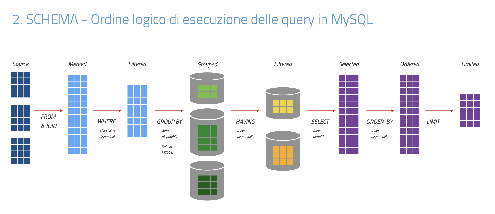

## Ottimizzazione Query in MySQL

1. Introduzione all'ottimizzazione delle query

2. Ordine di esecuzione delle query in MySQL

3. Strategie di ottimizzazione basate sull'ordine di esecuzione

---

### Introduzione all'ottimizzazione delle query

L'ottimizzazione delle query è cruciale per migliorare le prestazioni delle applicazioni database.

Un'ottima comprensione dell'ordine di esecuzione delle query SQL in MySQL è fondamentale per ottimizzare efficacemente le query.

---

### Ordine di esecuzione delle query in MySQL

L’ordine seguente rappresenta **l’ordine logico** di elaborazione di una query SQL, utile per comprendere come e quando vengono applicati filtri, aggregazioni e ordinamenti.

- `FROM` e `JOIN`: recupera le righe dalle tabelle di origine. Effettua le unioni specificate.

- `WHERE`: filtra le righe in base alle condizioni specificate. Rimuove le righe che non soddisfano le condizioni.

- `GROUP BY`: raggruppa le righe per una o più colonne. Aggrega i dati per i gruppi specificati.

- `HAVING`: filtra i gruppi creati dal `GROUP BY` basandosi su condizioni di aggregazione.

- `SELECT`: seleziona le colonne specificate per l'output finale.

- `ORDER BY`: ordina il risultato in base ai criteri specificati.

- `LIMIT`: limita il numero di righe restituite dal risultato finale.

> Nota
> - MySQL può riordinare le operazioni
> - `JOIN`, `WHERE`, `GROUP BY` possono essere ottimizzati in modo non sequenziale
> Usa `EXPLAIN ANALYZE` per mostra il piano reale

---



---

### Strategie di ottimizzazione basate sull'ordine di esecuzione

#### Ottimizzazione di FROM e JOIN

- **Utilizzo di Indici**: assicurati che le colonne utilizzate nelle condizioni di join siano indicizzate.

- **Riduzione delle tabelle**: unisci solo le tabelle necessarie per ridurre il carico di elaborazione.

- **Ordina le JOIN** in modo che le tabelle più selettive vengano filtrate prima (l’ottimizzatore spesso lo fa automaticamente)

#### Ottimizzazione di WHERE

- **Filtraggio precoce**: applica condizioni di filtro il prima possibile per ridurre il numero di righe da elaborare.

- **Condizioni di filtraggio ottimali**: utilizza indici sulle colonne utilizzate nelle condizioni WHERE.

- **Evita funzioni su colonne indicizzate** (perché rompono l’uso dell’indice)

**Esempio:**

```sql
WHERE YEAR(data_nascita) = 2000 -- Non usa indice su data_nascita
```

```sql
WHERE data_nascita BETWEEN '2000-01-01' AND '2000-12-31' -- Usa indice
```

#### Ottimizzazione di GROUP BY e HAVING

- **Riduzione dei gruppi**: raggruppa solo quando necessario e cerca di ridurre il numero di gruppi.

- **Utilizzo di indici**: indici su colonne di raggruppamento possono migliorare le prestazioni.

> Usa `WHERE` invece di `HAVING` quando possibile, perché `WHERE` filtra le righe prima dell’aggregazione.

#### Ottimizzazione di SELECT

**Selezione delle colonne necessarie**: evita `SELECT *` e *seleziona solo le colonne necessarie*.

**Eliminazione delle duplicazioni**: utilizza `DISTINCT` solo quando necessario.

`DISTINCT` crea overhead se applicato su grandi dataset. Verifica sempre se è realmente necessario.

#### Ottimizzazione di ORDER BY e LIMIT

- Indici per ordinamento: utilizza indici sulle colonne utilizzate per l'ordinamento.

- Utilizzo di `LIMIT`: limita il numero di righe restituite per migliorare le prestazioni.

> Un indice può essere usato per `ORDER BY` solo se l’ordine richiesto è compatibile con l’indice (stesso ordine e stessa direzione).

### “Ottimizzazione pratica: regole d’oro”

- Usa sempre `EXPLAIN` / `EXPLAIN ANALYZE`

- Ottimizza prima le query più lente (non tutte)

- Indici basati sulle query reali

- Evita micro-ottimizzazioni premature (prima misura, poi ottimizza)

    - fatte prima di sapere se servono

    - basate su supposizioni

    - che complicano il codice senza benefici misurabili

    **Esempi**:

    - Riscrivere query già veloci

    - Aggiungere indici “a caso”

    - Eliminare `DISTINCT` senza capire perché serviva

    - Ottimizzare query che girano 1 volta al giorno
