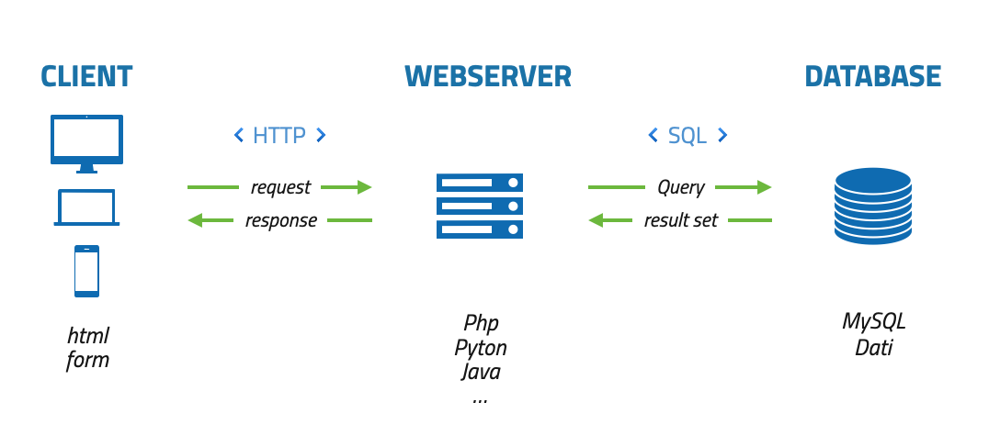

# Cos’è un Database

## Un database è una raccolta organizzata di dati archiviati in un formato facilmente accessibile.

- I **database** (o basi di dati) sono **collezioni di dati** tra loro correlati, utilizzate per rappresentare una porzione del mondo reale.
Sono strutturati in modo tale da consentire la gestione efficiente dei dati, permettendo operazioni come **inserimento**, **aggiornamento**, **ricerca** e **cancellazione** delle informazioni.

- In informatica, il termine **database** indica una **struttura organizzata di dati**.
I database (o più brevemente, DB) sono archivi dove le applicazioni memorizzano i dati in modo **persistente** per poterli successivamente leggere, modificare o eliminare.

### Persistenza

In ambito informatico, la persistenza si riferisce alla **capacità di un dato di essere conservato oltre la durata di esecuzione di un singolo programma**, garantendo che i dati siano ancora disponibili in seguito.

**Sintesi**

**Un database è un insieme di dati**:

- organizzati

- strutturati

- persistenti (salvati nel tempo)

- vengono gestiti tramite un software chiamato DBMS.

Un database è un archivio digitale intelligente, che permette di salvare, cercare e aggiornare informazioni in modo ordinato e sicuro.

- Elenco clienti

- Studenti e voti

- Prodotti e prezzi

- Ordini e fatture

Senza database, i dati sarebbero sparsi, duplicati o difficili da gestire.

**Componenti e Funzioni di un DBMS**

*Componenti di un Database*

Un sistema di basi di dati è composto da:

- **Dati** → le informazioni vere e proprie

- **Hardware** → computer e server

- **Software (DBMS)** → programma che gestisce i dati

- **Utenti** → persone o applicazioni che usano i dati

- **Procedure** → regole su come usare e gestire il database

**Funzioni principali di un DBMS**

Il DBMS serve a:

- Garantire indipendenza dei dati

- Gestire sicurezza e autorizzazioni

- Permettere l’accesso contemporaneo a più utenti

- Assicurare integrità e coerenza dei dati

- Eseguire backup e ripristino

- Migliorare le prestazioni con l’ottimizzazione delle query

Il DBMS protegge i dati e li rende facilmente utilizzabili.

---

## Dati e Informazione

- **Informazione**: dato elaborato con significato e contesto.
In senso generale, l'informazione è qualsiasi contenuto significativo che possiamo trasmettere, raccogliereo interpretare. Tuttavia, perché l'informazione diventi utile, deve essere organizzata e strutturata in unaforma che ne consenta una facile elaborazione.

- **Dati**: rappresentazioni grezze di fatti, numeri o eventi.
Un dato è un'unità elementare di informazione, che può essere un numero, unaparola, un'immagine, ecc.

> Ad esempio, una stringa di caratteri come "Maria", oppure un numero come "30", sono dati grezzi.
Da soli,però, non raccontano molto.
Per renderli significativi dobbiamo inserirli in un contesto strutturato, ad esempio: "Maria ha 30 anni."

---

## Database file-server, client-server

| Database file-server | Database client-server |
|--------------------|----------------------|
| Sono semplici file, a cui possono facilmente accedere i programmi che li usano per inserire, visualizzare, modificare o cancellare i dati in essi contenuti. • il sistema accede fisicamente al file; • più il file è di grandi dimensioni maggiore il tempo di accesso; • accesso contemporaneo da più utenti rallenta notevolmente il db; • MS Access, FileMaker, … | Rappresentano un servizio che mette a disposizione il software per interagire con i dati. Viene gestito e manutenuto dai DBA (Database Administrator). • Microsoft SQL Server (RDBMS) • Oracle (RDBMS) • MySQL (RDBMS) • DB2 (RDBMS) • PostgreSQL (ORDBMS) • MongoDB (NoSQL) • Neo4j (NoSQL)

---

## Client-server
### Esempio di richiesta dati attraverso un form via https

---

## VANTAGGI DATABASE CLIENT-SERVER

1. I clients **non accedono fisicamente al file** sul database, inviano solamente la loro query al motore del database ed il
    server restituisce solamente i dati richiesti.

2. **Velocità**: al crescere delle dimensioni del database il tempo di una query rimane identico, perché attraverso la LAN
    viaggiano e continueranno a viaggiare solamente la richiesta (query) ed i dati restituiti, la dimensione del database
    diventa alla fine irrilevante per il client.

3. Il motore del database è in grado di gestire tutte le **connessioni simultanee** da parte degli utenti, ed utilizzare al
    meglio le prestazioni dell'hardware.

4. **Sicurezza**. Se su un sistema file-server potrebbe succedere che in determinate situazioni il file arrivi ad essere corrotto
    (termine tecnico), questo non deve potere succedere, mai e per nessuna ragione, su un sistema client-server.

5. La sicurezza viene garantita anche grazie alle funzioni che i db client-server normalmente offrono. Tutte le tabelle di un
    sistema gestionale aziendale sono tra loro collegate, la mancanza della gestione delle relazioni può portare a grossi
    problemi circa l' **integrità dei dati**.

---

## Concetti genarli riguardo i Database

| Concetto                               | Applicabilità       | Note                                                          |
| -------------------------------------- | ------------------- | ---------------------------------------------------------------------------------- |
| **Dati**                               | Tutti i DB          | Informazioni salvate (numeri, testi, immagini, vettori)                            |
| **Database**                           | Tutti i DB          | Archivio organizzato di dati persistenti                                           |
| **DBMS**                               | Tutti i DB          | Software che gestisce i dati                                                       |
| **Utenti / Ruoli**                     | Tutti i DB          | Persone o applicazioni che accedono ai dati                                        |
| **Operazioni principali**              | Tutti i DB          | Inserimento, aggiornamento, cancellazione, lettura                                 |
| **Integrità dei dati**                 | Tutti i DB          | Dati coerenti, corretti e affidabili                                               |
| **Sicurezza / autorizzazioni**         | Tutti i DB          | Chi può leggere o scrivere dati                                                    |
| **Backup & Restore**                   | Tutti i DB          | Protezione dei dati da guasti o perdite                                            |
| **Persistenza**                        | Tutti i DB          | I dati rimangono salvati anche dopo la chiusura                                    |
| **Indipendenza dei dati**              | Tutti i DB          | Applicazioni e dati sono separati                                                  |
| **Scalabilità**                        | Tutti i DB          | Capacità di crescere con dati o utenti                                             |
| **Accesso concorrente / multi-utenza** | Tutti i DB          | Più utenti possono lavorare contemporaneamente                                     |
| **Modello dei dati**                   | Tutti i DB          | Organizzazione concettuale dei dati (relazionale, documentale, grafi, vettoriale…) |

## Concetti specifici riguardo particolari Database

| Concetto                               | Applicabilità       | Note                                                          |
| -------------------------------------- | ------------------- | ---------------------------------------------------------------------------------- |
| **Normalizzazione**                    | Solo RDBMS          | Organizzazione tabelle per ridurre ridondanza e incongruenze                       |
| **Query SQL**                          | Solo RDBMS / SQL DB | Linguaggio per interrogare e aggiornare dati                                       |
| **Chiavi primarie / esterne**          | Solo RDBMS          | Identificano righe uniche e collegano tabelle                                      |
| **Join**                               | Solo RDBMS          | Collegamento tra tabelle basato su chiavi                                          |